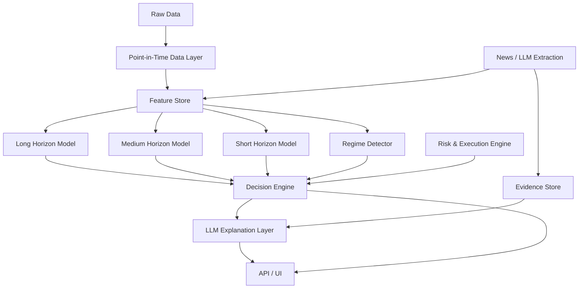

# Finance AI Analysis Platform - System Schema

## 1. Design principle

The system is a **multi-horizon research and decision engine**, not a single price predictor.

- Long: 3-24 months
- Medium: 1 day-8 weeks
- Short: 1 minute-1 day
- Risk: independent of return prediction
- LLM: evidence extraction + explanation, not the primary numeric decision engine

## 2. Architecture



## 3. Core entities

```text
Asset
  id
  symbol
  asset_class: stock | crypto
  exchange
  sector
  country

MarketBar
  asset_id
  timeframe
  event_time
  open high low close volume

FundamentalObservation
  asset_id
  metric
  period_end
  published_at
  effective_at
  value
  revision
  source_id

NewsEvent
  event_id
  published_at
  source_id
  asset_id
  event_type
  direction
  materiality
  novelty
  certainty
  expectedness
  horizon
  extraction_version

FeatureObservation
  asset_id
  feature_id
  event_time
  value
  feature_version
  data_quality

Prediction
  asset_id
  as_of
  horizon
  expected_return
  probability_up
  probability_down
  expected_volatility
  model_version

RiskAssessment
  asset_id
  as_of
  liquidity_score
  slippage_estimate
  drawdown_risk
  concentration_risk
  event_risk
  tradable

DecisionObject
  asset_id
  as_of
  long_view
  medium_view
  short_view
  regime
  execution
  catalysts[]
  risks[]
  invalidation[]
  data_quality
  model_metadata
```

## 4. Feature namespaces

### STOCKS
- `px.*` price, return, trend, relative momentum
- `vol.*` realized/implied volatility
- `liq.*` ADV, spread, depth, slippage proxy
- `val.*` valuation ratios and history-relative valuation
- `qual.*` ROIC/ROE/margins/FCF conversion/accruals
- `growth.*` revenue/EPS/EBITDA/FCF growth
- `earn.*` surprise and guidance
- `est.*` analyst revisions
- `bs.*` balance sheet and cash-flow features
- `capalloc.*` buybacks/dividends/M&A/debt/dilution/SBC
- `position.*` short interest / borrow / ownership
- `macro.*` rates/DXY/VIX/credit/oil/gold/index state
- `news.*` event extraction and sentiment persistence
- `regime.*` state probabilities

### CRYPTO
- `px.*`, `vol.*`, `liq.*` as above
- `token.*` supply/FDV/inflation/burn/unlocks
- `chain.*` addresses/tx/fees/revenue/TVL/stablecoins/exchange flows
- `onchain.*` MVRV/realized metrics/SOPR/holder structure
- `deriv.*` funding/OI/basis/liquidations/options
- `micro.*` order book/trade flow/cross-exchange
- `news.*`, `social.*`, `macro.*`, `regime.*`

## 5. Target definitions

Preferred targets:

1. Future excess/residual return
2. Probability of directional move crossing a threshold
3. Future realized volatility
4. MFE / MAE
5. Triple-barrier outcome
6. Cross-sectional rank

Do not optimize the system around exact future-price prediction.

## 6. Point-in-time rules

Every information record must retain:

- `published_at` - when market could know the information
- `effective_at` - period/condition represented
- `ingested_at` - when the pipeline received it
- `revision` - historical versioning

Backtests must join by **availability time**, not by accounting period end alone.

## 7. Decision contract

```json
{
  "asset": {"id":"...","symbol":"...","asset_class":"stock"},
  "as_of":"...",
  "views": {
    "long": {"direction":"bullish","expected_return":0.28,"probability":0.74,"risk":"high"},
    "medium": {"direction":"neutral","expected_return":0.03,"probability":0.56,"risk":"medium"},
    "short": {"direction":"bearish","expected_return":-0.012,"probability":0.68,"risk":"high"}
  },
  "regime": {"label":"high_vol_deleveraging","probability":0.79},
  "execution": {"estimated_cost":0.003,"tradable":true},
  "catalysts": [],
  "risks": [],
  "invalidation": [],
  "data_quality": {"freshness":0.94,"completeness":0.98},
  "model": {"version":"v1.0.0","feature_version":"f12"}
}
```

## 8. Engineering rules for Claude

1. Python 3.12+ with typing.
2. FastAPI for service boundary.
3. PostgreSQL for canonical storage.
4. Redis only for caching / transient state.
5. Polars preferred for large tabular feature generation; Pandas allowed at boundaries.
6. scikit-learn + LightGBM/CatBoost for baselines.
7. PyTorch is a later extension, not the V1 dependency for every model.
8. Every feature calculator must have unit tests with synthetic timestamps.
9. Every dataset builder must have automated leakage tests.
10. Model registry must store code version, feature version, training window, data snapshot and metrics.
11. Backtesting must be event-driven enough to model fees, spread and slippage.
12. Do not connect to live order execution in V1.
13. LLM outputs must be structured JSON and source-linked.
14. UI must display model confidence, data confidence and execution confidence separately.
15. Every decision must have an explicit `NO_TRADE` path.
